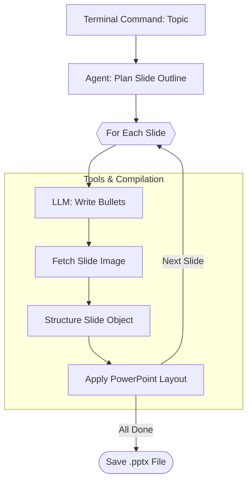

# Auto PPT Agent

A fully automated, AI-powered PowerPoint generation system that creates visually appealing, content-rich presentations from a single topic prompt. 

By leveraging Large Language Models and dynamic image generation APIs, the Auto PPT Agent builds completely customized `.pptx` files with professional slide outlines, tailored bullet points, and perfectly contextual images—minimizing user effort to just a single terminal command.

---

## ✨ Features
- **Zero-to-PPT in Seconds**: Give it a topic, and it plans, writes, and formats a full presentation automatically.
- **Multi-LLM Support**: Natively compatible with **OpenAI**, **Gemini**, and **Grok** APIs.
- **Dynamic Image Generation**: Automatically generates contextual, perfectly tailored images for every individual slide using Pollinations.ai.
- **Native `.pptx` Exports**: Outputs standard PowerPoint files ready to be opened, presented, or manually tweaked.

---

## 🖥️ Demo 

See the Auto PPT Agent in action!

- 📺 [**Watch the 2-minute Quick Demo**](https://drive.google.com/file/d/1dw-CLu41Woc6Okaa-9OF-d3Hz_Mt9ONe/view?usp=sharing)
---

## 🛠️ Installation & Setup

1. **Clone or Download the Repository**
2. **Install Dependencies**  
   Ensure you have Python installed, then run:
   ```bash
   pip install -r requirements.txt
   ```
3. **Configure your API Keys**  
   Rename `.env.example` to `.env` in the root directory and add your preferred provider's API key:
   ```env
   OPENAI_API_KEY=your_openai_api_key_here
   GEMINI_API_KEY=your_gemini_api_key_here
   XAI_API_KEY=your_grok_api_key_here
   ```
   *(The system will automatically detect which key is available and select the appropriate model.)*

---

## 💻 Usage

Run the agent via the terminal by passing your desired presentation topic. 

```bash
python main.py "Explain Machine Learning for Beginners"
```

The script will outline the slides, fetch images, assemble the presentation, and export a final `.pptx` file directly to your project folder.

---

## 🏗️ Architecture & Workflow

The system is highly modular, separating the logic of LLM orchestration from the actual file manipulation tools.

1. `main.py` parses the user's terminal input and triggers the agent.
2. `agent.py` queries the LLM to strategically outline subtopics.
3. For every subtopic, `tools.py` steps in:
   - Queries the LLM to write concise bullet points.
   - Fetches a dynamically generated AI image tailored to the slide contents.
   - Embeds the content and picture into a `python-pptx` template.



---

## 📂 Project Structure

```text
auto_ppt_agent/
├── agent.py               # Orchestration and Agent Logic
├── main.py                # Command-line Entry Point
├── tools.py               # Core actions (PPT rendering, LLM parsing, image generation)
├── requirements.txt       # Python Dependencies
├── .env.example           # Example API Key setups
└── README.md              # Documentation
```
