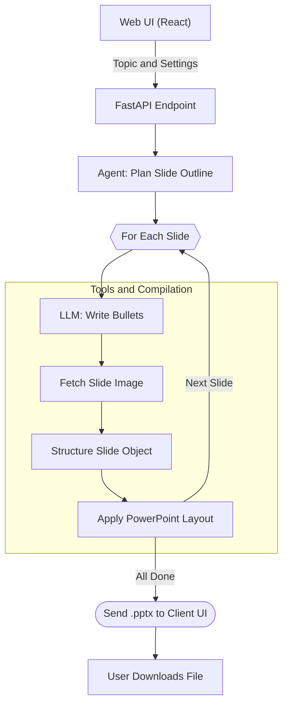

# Auto PPT Agent

A fully automated, AI-powered PowerPoint generation system that creates visually appealing, content-rich presentations from a single topic prompt. 

By leveraging Large Language Models and dynamic image generation APIs, the Auto PPT Agent builds completely customized `.pptx` files with professional slide outlines, tailored bullet points, and perfectly contextual images—now accessible through a modern, responsive web interface!

---

## ✨ Features
- **Modern Web Interface**: Clean, intuitive UI built with React and Vite for easy presentation generation.
- **Zero-to-PPT in Seconds**: Give it a topic, and it plans, writes, and formats a full presentation automatically.
- **Multi-LLM Support**: Natively compatible with **OpenAI**, **Gemini**, and **Grok** APIs.
- **Dynamic Image Generation**: Automatically generates contextual, perfectly tailored images for every individual slide using Pollinations.ai.
- **Native `.pptx` Exports**: Outputs standard PowerPoint files ready to be downloaded immediately from the app.

---

## 🖥️ Demo 

See the Auto PPT Agent in action!

- 📺 [**Watch the 2-minute Quick Demo**](https://drive.google.com/file/d/1dw-CLu41Woc6Okaa-9OF-d3Hz_Mt9ONe/view?usp=sharing)
---

## 🛠️ Installation & Setup

1. **Clone or Download the Repository**

2. **Backend Setup (Python/FastAPI)**  
   Navigate to the `backend` directory and install dependencies:
   ```bash
   cd backend
   pip install -r requirements.txt
   ```
   *Note: Ensure you have Python installed.*

3. **Configure your API Keys**  
   Inside the `backend` directory, rename `.env.example` to `.env` (or create a new `.env` file) and add your preferred provider's API key:
   ```env
   OPENAI_API_KEY=your_openai_api_key_here
   GEMINI_API_KEY=your_gemini_api_key_here
   XAI_API_KEY=your_grok_api_key_here
   ```
   *(The system will automatically detect which key is available and select the appropriate model.)*

4. **Frontend Setup (React/Vite)**
   Open a new terminal tab, navigate to the `frontend` directory, and install dependencies:
   ```bash
   cd frontend
   npm install
   ```
   *Note: Ensure you have Node.js and npm installed.*

---

## 💻 Usage

To run the application, you'll need two terminal windows running simultaneously.

**1. Start the Backend API:**
```bash
cd backend
python -m uvicorn api:app --reload
```
*The backend API will run on `http://127.0.0.1:8000`.*

**2. Start the Frontend Web App:**
```bash
cd frontend
npm run dev
```
*The React app will naturally run on a local port like `http://localhost:5173`. Open this URL in your browser.*

Enter your desired presentation topic right into the web interface, customize the number of slides, and click generate. Your `.pptx` file will download automatically once it's built!

---

## 🏗️ Architecture & Workflow

The system is highly modular, separating the web GUI, the API routing layer, and the core agent logic.

1. **Frontend (React)**: Collects user input (topic, number of slides) and sends a request to the backend.
2. **Backend Engine** (`backend/api.py`, `backend/agent.py`):
   - Receives the request and triggers the PPT Generation pipeline.
   - `agent.py` queries the LLM to strategically outline subtopics.
3. **Core Tools** (`backend/tools.py`):
   - For every subtopic, queries the LLM to write concise bullet points.
   - Fetches a dynamically generated AI image tailored to the slide contents.
   - Embeds the content and picture into a `python-pptx` template.
4. **File Delivery**: The generated `.pptx` file is served directly back to the frontend to automatically download on the client UI.



---

## 📂 Project Structure

```text
auto_ppt_agent/
├── backend/
│   ├── api.py             # FastAPI entrypoint, handles requests
│   ├── agent.py           # Orchestration and Agent Logic
│   ├── tools.py           # Core logic (PPT rendering, LLMs, images)
│   ├── main.py            # Legacy Command-line Entry Point
│   ├── requirements.txt   # Python Dependencies
│   └── .env.example       # Example API Key setups
├── frontend/
│   ├── src/               # React Web App Source Code
│   ├── index.html         # Web Entrypoint
│   ├── package.json       # Node Dependencies
│   └── vite.config.js     # Bundler Config
└── README.md              # Documentation
```
