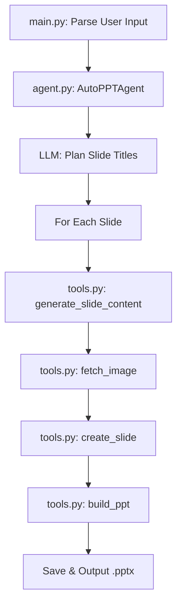
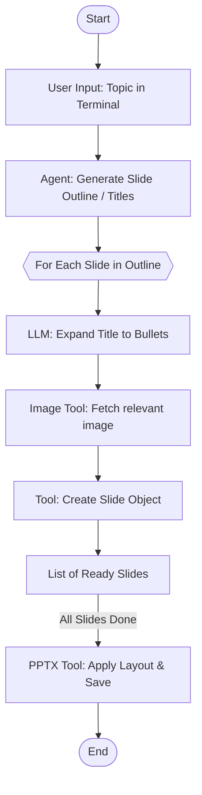

# Auto PPT Agent

A fully automated, AI-powered PowerPoint generation system that creates visually appealing, content-rich presentations from a single topic prompt. The project leverages LLMs and dynamic image generation to generate professional PPTs with minimal user input.

---

## 🚀 Overview
Auto PPT Agent is a modular Python system that:
- Accepts a topic and slide count from the user via the command line.
- Plans slide subtopics using a pre-configured LLM (supports OpenAI, Gemini, and Grok).
- Dynamically generates slide content (titles and bullet points).
- Fetches perfectly tailored images via Pollinations.ai based on slide content.
- Assembles and saves a complete PowerPoint file (`.pptx`) with structured layouts.

---

## 🏗️ Architecture Diagram



---

## 🧩 Component Table

| Component         | Description                                                                 | Key Tools/Functions                |
|-------------------|-----------------------------------------------------------------------------|------------------------------------|
| **main.py**       | Entry point for the application. Parses CLI arguments (topic, slides) and invokes the agent. | `main()` |
| **agent.py**      | Orchestrates the workflow. Initializes the LLM client, plans slides, and drives the slide creation loop. | `AutoPPTAgent`, `plan_slides`, `generate_ppt` |
| **tools.py**      | Handles specific tasks: generating content, fetching images, structurig objects, and PPT building. | `generate_slide_content`, `fetch_image`, `create_slide`, `build_ppt`, `get_llm_client_and_model` |
| **.env**          | Stores API keys for respective LLM providers.                               | `OPENAI_API_KEY`, `GEMINI_API_KEY`, `XAI_API_KEY` |

---

## 🛠️ Tools Table

| File/Module    | Tool/Function Name      | Purpose                                                      |
|----------------|-------------------------|--------------------------------------------------------------|
| `tools.py`     | `generate_slide_content`| Queries the LLM to write 3-5 concise bullet points and a slide title. |
| `tools.py`     | `fetch_image`           | Fetches a relevant free-to-use generated image using Pollinations.ai. |
| `tools.py`     | `create_slide`          | Structures the title, bullet points, and image into a slide object. |
| `tools.py`     | `build_ppt`             | Creates the actual `python-pptx` presentation and saves it to disk. |

---

## ⚙️ Workflow Table

| Step | Action                                      | Responsible Component/Tool         |
|------|---------------------------------------------|------------------------------------|
| 1    | User provides topic string and slide count  | `main.py`                          |
| 2    | LLM generates logical slide subtopics       | `agent.py` (`plan_slides`)         |
| 3    | LLM expands subtopic into bullet points     | `tools.py` (`generate_slide_content`) |
| 4    | Construct search query and fetch image      | `tools.py` (`fetch_image`)         |
| 5    | Assemble text and image data                | `tools.py` (`create_slide`)        |
| 6    | Compile slides into `.pptx` and format      | `tools.py` (`build_ppt`)           |
| 7    | Save final output to computer               | `agent.py`                         |

---

## 🔄 Detailed Flowchart



---

## 🖥️ Demo Video
[Watch the code explanation + demo here (10min video)](https://1drv.ms/v/c/75e01f03144d2386/IQBpT1PncEtVQbxp1IcXz3Y5AQhS8_namSxjOSYrgJY3eiE?e=Whp2tI)

[Watch the 2 min demo here](https://1drv.ms/v/c/75e01f03144d2386/IQADHibZlcluTrui5cIcGJMFASmSC9_HRnUj4k1XGpJJulU?e=Oe86x4)

---

## 📂 Project Structure

```text
auto_ppt_agent/
├── agent.py               # Orchestration and Agent Logic
├── main.py                # Command-line Entry Point
├── tools.py               # Core actions (PPT rendering, text generation)
├── requirements.txt       # Python Dependencies
├── .env.example           # Example API Key setups
└── README.md              # You are here
```

---

## 📝 Notes
- **API Keys**: Supports OpenAI (`OPENAI_API_KEY`), Gemini (`GEMINI_API_KEY`), or Grok (`XAI_API_KEY`). Add your preferred platform's key to the `.env` file.
- All LLM prompts are completely customizable via `agent.py` and `tools.py`.
- Images are retrieved dynamically from an open image generation API so you will never get a placeholder.
- **Running the code**: Use `python main.py "Your Topic Here"` to start.

---

## 📧 Contact
For questions, suggestions, or contributions, please open an issue or contact the maintainer.
